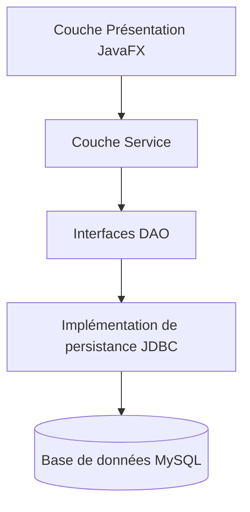

# ArtConnect Pro - Plateforme de Communauté Artistique Locale

## Aperçu
ArtConnect Pro est un système de gestion basé sur JavaFX pour les communautés artistiques locales. Il permet de gérer les artistes, les œuvres d'art, les expositions, les galeries, les ateliers et les membres de la communauté.

Ce projet représente une application **entièrement implémentée** mettant en valeur :
1. **Architecture en couches** : Couches Présentation, Service, DAO et Modèle.
2. **Persistance des données** : DAO JDBC entièrement fonctionnels connectés à une base de données MySQL.
3. **Interface Utilisateur JavaFX** : Tableaux dynamiques, formulaires et opérations CRUD persistantes directement depuis l'interface utilisateur.

## Structure du Projet
- `org.project.artconnect.MainApp` : Point d'entrée.
- `org.project.artconnect.model` : Entités du domaine (POO stricte, utilisant des références d'objets plutôt que des ID explicites).
- `org.project.artconnect.dao` : Interfaces DAO (Data Access Object) définissant les opérations CRUD.
- `org.project.artconnect.persistence` : Implémentations JDBC complètes traduisant les tables SQL en graphes d'objets Java.
- `org.project.artconnect.service` : Couche logique métier exécutant les services liés à la base de données.
- `org.project.artconnect.ui` : Contrôleurs JavaFX et vues FXML enrichis des fonctionnalités d'Ajout/Édition/Suppression persistantes.
- `org.project.artconnect.util` : Classes utilitaires comme `ConnectionManager` et `ServiceProvider` (configurées pour utiliser la base de données).

## Comment l'exécuter
Pré-requis : Java 17+, Maven et une base de données MySQL active.

1. **Configuration de la Base de données** : Exécutez les scripts SQL situés dans `src/Database/` pour initialiser et peupler votre base de données MySQL.
2. **Configuration Globale** : Assurez-vous que `DatabaseConfig.java` (dans `org.project.artconnect.config`) contient les bons identifiants et mot de passe.
3. **Lancement** :
```bash
mvn clean javafx:run
```
L'application s'exécute en se connectant directement à votre base de données MySQL. Toute opération CRUD effectuée dans l'interface est immédiatement sauvegardée.

## Conception Orientée Objet (POO)
L'architecture respecte les bonnes pratiques strictes de la Programmation Orientée Objet, gérant les différences Objet-Relationnel (Object-Relational Mismatch) de manière élégante :
- **Pas d'ID Explicites** : Les classes du modèle (`Artist`, `Artwork`, etc.) n'ont **pas** de champs `id`. Les ID de la base de données (Clés Primaires) sont gérés de manière transparente au niveau de la couche DAO.
- **Références d'Objets Directes** : Les relations sont modélisées à l'aide de références directes. Par exemple, un objet `Artwork` contient une référence directe vers un `Artist`.
- **Mapping Relationnel** : Les jointures de base de données et les clés étrangères sont traduites de manière fluide en collections Java imbriquées et en associations d'entités au sein des DAO.

## Fonctionnalités Réalisées
1. **Intégration JDBC Complète** : Création de DAO complets (`JdbcArtistDao`, `JdbcArtworkDao`, `JdbcGalleryDao`, `JdbcCommunityMemberDao`, `JdbcWorkshopDao`, `JdbcExhibitionDao`) avec des requêtes SQL sécurisées via `PreparedStatement`.
2. **Opérations CRUD dans l'interface** : Ajout de pop-ups UI (`Dialog`) non intrusifs dans tous les onglets d'entités pour permettre des actions d'Ajout, de Modification et de Suppression en temps réel, directement enregistrées dans la base de données.
3. **Câblage des Services** : Remplacement des données fictives en mémoire par les véritables services liés à MySQL au sein du `ServiceProvider`.
4. **Synchronisation des Données** : Alignement des types du modèle objet Java avec les schémas SQL (adaptation de l'énumération pour les types d'abonnements des membres, conversion des adresses de galeries en champs primitifs divisés, support cohérent et robuste des formats de Date).

## Diagramme d'Architecture

